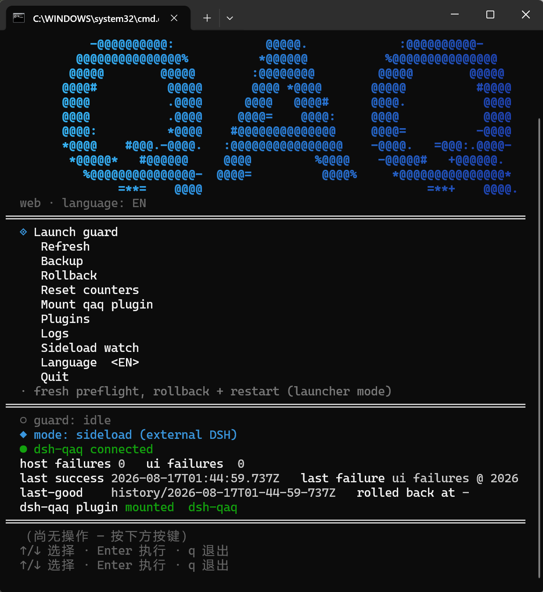
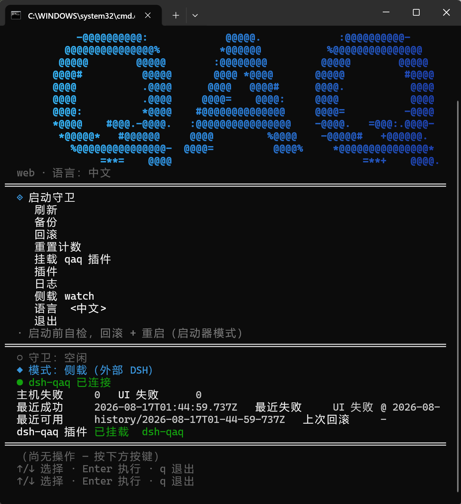

# QAQ — DeepSeek Harness Launch Resilience Guard

[简体中文](./README.md)

QAQ is a **launch resilience guard** for [DeepSeek Harness](https://github.com/deepseek-ai/deepseek-harness) (DSH). When a disrupted profile configuration prevents DSH from starting normally — a crashed host **or** a red-screened Web UI — QAQ automatically restores the configuration snapshot from the last successful boot and restarts, while preserving the broken config for manual recovery.

**Author**: WTStarMark

**Non-invasive**: QAQ never edits DSH source. The guard is a standalone executable that supervises the `dsh web` process and reads the browser's real DOM over CDP; the backup plugin only reads configuration and never changes behavior.

<p align="center">
  
  
</p>

## What it solves

DSH's Web surface has a failure mode where the **host is alive but the UI red-screens**: the host process runs, the port responds, yet the browser renders `Failed to load plugins`. Such failures are invisible to host-process monitoring and cannot be detected by `curl` (the server-side HTML ships an empty `<div id="root">`, rendered client-side). The only reliable non-invasive probe is to open the page in a headless browser and read the actual DOM. QAQ's UI-detection line is exactly that.

## Requirements

- Node.js >= 22
- A Chrome/Chromium/Edge binary on the machine (used headlessly via CDP; no Playwright/Puppeteer dependency)
- The `dsh` command on `PATH`, or an explicit `QAQ_DSH_CMD` / `--cwd`

## Install / Quick start

**One command**: `qaq setup` installs dependencies + builds, then `qaq tui` opens the full-screen live guard dashboard.

Or manually:

```bash
pnpm install
pnpm build   # bundles dist/qaq.mjs AND regenerates packages/dsh-qaq/lib (the plugin)
```

> `bin/qaq.cmd` runs the CLI through tsx for development; the global `qaq`
> command (from `pnpm build`) runs the bundled `dist/qaq.mjs`. Both share the
> same CLI surface. `qaq console` / `qaq tui` opens the full-screen dashboard
> on a TTY, or a compact menu otherwise.

**Recommended daily driver: `qaq tui`** — the full-screen live dashboard is the all-in-one entry (supervised launch, logs, plugin manager, hot update, sideload watch):

```bash
qaq tui --port 3080
```

> Prefer a single supervised boot without the dashboard? Run it directly:

```bash
qaq dsh web --port 3080 --yes
```

> **Which `dsh` runs?** The guard defaults to `dsh web` (`PATH` resolution). To run from the DSH source tree instead:
> 
> ```bash
> QAQ_DSH_CMD="node --import tsx/esm apps/cli/src/bin.ts web" qaq dsh web --cwd /path/to/dsh-checkout
> ```

> **Pre-launch self-check**: `qaq dsh web` (and the console) auto-discover the `dsh` command — `QAQ_DSH_CMD` → `--cwd` → a nearby DSH checkout (ancestors of the current directory, plus a sibling checkout sitting next to it, e.g. QAQ and `deepseek-harness` side by side) → `PATH` — pick a Chrome/Chromium/Edge binary for the UI probe, and verify the target port is free. Problems are reported with actionable Chinese hints before anything is spawned.

## Commands

| Command                                      | Purpose                                                                                                     |
| -------------------------------------------- | ----------------------------------------------------------------------------------------------------------- |
| `qaq dsh web [--port N] [--yes]`             | supervised startup: detect host/UI failure -> count -> roll back when triggered -> restart (with anti-loop) |
| `qaq status`                                 | print a summary of `~/.dsh/.qaq/state.json`                                                                 |
| `qaq backup [--profile web]`                 | snapshot the current profile into the MANUAL backup set (independent 3-snapshot quota)                                                                   |
| `qaq restore --to <snapDir> [--profile web]` | restore a profile from a snapshot directory                                                                 |
| `qaq reset --profile web`                    | zero the failure counters                                                                                   |
| `qaq tui` / `qaq console`                   | open the full-screen live dashboard (or a compact menu on non-TTY)                                          |
| `qaq setup`                                | install dependencies + build (one command)                                                                  |
| `qaq install-plugin [--profile web]`         | auto-mount the `dsh-qaq` backup plugin into a profile                                                       |

Global: `--yes` auto-confirms rollbacks.

## Dashboard (`qaq tui` / `qaq console`)

On a terminal (`qaq tui`) QAQ shows a **full-screen, auto-refreshing dashboard** — the all-in-one entry for launching, watching, browsing logs, and managing plugins. It shows guard status, the current operating mode (launcher / sideload / idle), failure counters, last-good snapshot, plugin mount state, the **current version number**, a **log viewer**, and a **plugin manager**. On a non-TTY it falls back to a one-screen menu (`qaq console`). The interface is **bilingual** — press `12` in the TUI to toggle en/zh (a bare `qaq console` defaults to Chinese; `$QAQ_LANG` or `--lang` overrides). The actions available are:

```
[1]  supervise a dsh web boot (guard)   — fresh preflight each time, rollback + restart (launcher mode)
[2]  refresh state panel                — also auto-refreshes every ~1s
[3]  back up the current profile into the MANUAL backup set
[4]  backup/rollback list               — open the backup manager: auto vs manual groups, pick one to restore
[5]  reset failure counters
[6]  mount the dsh-qaq backup plugin     — idempotent, rollback-safe
[7]  manage plugins                     — install / uninstall / enable / disable
[8]  view logs                           — full-screen log viewer (error/access/host/qaq)
[9]  sideload watch                      — run a continuous sideload guard on an external DSH (toggle)
[10] hot update                         — client-plugin live-reload watch + auto-restart toggles
[11] check for updates (Beta)           — check GitHub for a newer version; press again to confirm the download
[12] toggle en / zh
[13] quit
```

Navigation: `↑`/`↓` (or `j`/`k`) move the selection, `Enter`/`Space` run the action, digits `1..N` jump straight to an action, `q`/`Esc`/`Ctrl+C` quit.

- **Version update (Beta, `[11]`)**: the dashboard header shows the local version (e.g. `v0.4.4`). Press `[11]` to check GitHub (<https://github.com/WTStarMark/QAQ>) for the latest version — when a newer release exists the status area shows `- new update vX.X.X`, and **pressing `[11]` again confirms the update**: the latest master source archive is downloaded to `~/.dsh/.qaq/update/` with the upgrade steps (`qaq setup`). Offline/failure only shows a message — it never touches any guard functionality.

- **Log viewer** (`[8]`): `1`–`4` switch between `error.log` / `access.log` / `host.log` / `qaq.log`, `↑`/`↓` scroll, `q`/`Esc`/`Enter` return to the menu.
- **Plugin manager** (`[7]`): manages the **real DeepSeek Harness** plugins. It auto-discovers the DSH installation (home + source checkout, detected running process via heartbeat), scans the checkout's `packages/` for the installable `@deepseek-ai/dsh-*` bundle packages, lists what's installed/enabled in the active profile, and lets you `↑`/`↓` select then `e` enable, `d` disable, `u` uninstall, `i` install. Disabling keeps the module installed but removes it from the profile's boot bundle; uninstalling removes both. It never touches QAQ's own repository.
- **dsh-qaq plugin**: **auto-mounted when the dashboard opens** — if the profile does not have dsh-qaq installed/enabled, QAQ mounts it automatically (bundle list entry + module link); an already-installed one is left untouched (best-effort, failures only warn). Menu `[6]` is a re-runnable **overwrite/update entry**: it validates the module link target and repairs a stale/orphaned link pointing at an old QAQ copy (junction target check, orphan repair, lib rebuild) — an old link never silently keeps loading old plugin code; a real directory/file at the path is never replaced (user-data protection).
- **Operating modes**: the status line shows which integration mode is active — **launcher** (QAQ owns a supervised `dsh web`), **sideload** (an external DSH is up, or a continuous sideload guard is watching it), or **idle**.
- **Backup manager** (`[4]`): the backup-list sub-screen, split into **auto backups** (written by the guard on confirmed health / the plugin after a real conversation; independent **10**-snapshot quota) and **manual backups** (written by `[3]` / `qaq backup`; independent **3**-snapshot quota). `↑`/`↓` move the selection, `Enter` restores the chosen backup, `q`/`Esc` returns.
- **Sideload guard** (`[9]`): a **toggle**. First press resolves the external DSH (the `--port` you gave `qaq tui`, else the dsh-qaq plugin heartbeat), pins that port, then keeps probing the real DOM every ~15s — counting host/UI failures and rolling back at threshold (auto-confirm, CLI-owned), exactly like `qaq watch`. Press `[9]` again (or quit) to stop. The status line shows the watched URL and the last probe outcome.
- **Hot update** (`[10]`): a three-channel plugin hot-update panel, **all toggles off by default**:
  - `[1]` **client bundle watch** — watches every enabled client plugin's `lib/client.js`; DSH's own client-hmr hot-swaps the browser fiber with no restart. QAQ owns **verification** (fresh-page CDP probe + the dsh-qaq plugin inventory) and **rollback**: the pre-change bundle is snapshotted to `~/.dsh/.qaq/hot-snapshots/`, on a failed swap the file is restored (which re-triggers client-hmr), re-verified, and only a persistent failure escalates to a supervised restart. It only reads/writes `.qaq` and profile files — **never state.json / last-good / failure counters / the rollback fence**.
  - `[2]` **auto-restart on bundle-list change** — a change to `dsh.profile.bundles` (plugin add/remove) needs a restart to apply; when on, the guard detects it and performs a **supervised restart** (kill → re-boot → health-confirm window, existing rollback path on failure) — a "pseudo" hot update. Requires launcher mode (`[1]`).
  - `[3]` **auto-restart on web dist change** — the frontend `apps/web/dist` (or installed `dsh-web-frontend/dist`) cannot hot-swap; when on, a rebuild triggers the same supervised restart.
  - In the plugin manager (`[7]`), enabling/disabling a **client-kind** plugin writes `cordis.patch.yml` and DSH's config HMR applies it **live** — QAQ polls the plugin inventory to confirm (`applied live ✔`), says "applies at next boot" when DSH is offline, and reports "old tree still running" on failure (DSH HMR keeps the last-good tree, matching the guard's never-break-the-boot posture). **Bundle-kind** changes still state "restart to apply"; pair them with `[2]`.

The panel auto-refreshes while a supervised `dsh web` runs; the guard lock is held until it exits (a second launch is refused and a stale port check never misfires). `q`/`Esc`/`Ctrl+C` quit the dashboard; a supervised child is killed so no process is left holding the port.

## Operations guide

### First-time setup (Windows)

1. **Install** — run `qaq setup`. It checks Node.js >= 22, installs dependencies (pnpm, with an npx fallback), and builds `dist/qaq.mjs` + the plugin lib.
2. **Mount the backup plugin (recommended)** — open `qaq tui` (the dashboard auto-mounts dsh-qaq when it opens; use menu `[6]` to re-mount/overwrite manually). This adds `dsh-qaq` to the profile's bundle list and links the module into the profile's `node_modules`. From then on, the plugin snapshots the config once a **real user conversation** has happened — the strongest proof the boot is actually usable. A host that settles but renders a web red screen never lets the user talk, so it is never recorded as last-good (backup-only; it never changes DSH behavior). The profile's own `cordis.patch.yml` is intentionally left untouched — DSH auto-loads the plugin's patch from its bundle declaration.
3. **Launch** — press `1` in the TUI menu (start the guard). The dashboard re-runs the pre-launch self-check (dsh command, browser, port), then supervises `dsh web`. Once the UI has been healthy for the confirmation window, the config is recorded as last-good and the guard keeps monitoring in the background.
4. **Verify** — `qaq status`: `hostFailures` / `uiFailures` should be 0 and `lastSuccess` / `lastGoodSnapshot` present.

### Everyday use

- Start DSH the same way every time: `qaq tui` → press `1`. Prefer not to start `dsh web` directly anymore — the guard owns the supervised process and is the only one that can detect a red screen.
- If the UI red-screens (or the host crashes) **3 times in a row**, QAQ offers a rollback to the last-good config with a diff preview. Accept it — the broken config is preserved under `~/.dsh/.qaq/rolled-back/` for later inspection, and the guard restarts once automatically.
- After a successful rollback + restart, the counters are zeroed and the anti-loop fence is cleared; the restored profile is the one you had before it broke.

### Troubleshooting

| Symptom                                        | What to do                                                                                                                                                                                                                      |
| ---------------------------------------------- | ------------------------------------------------------------------------------------------------------------------------------------------------------------------------------------------------------------------------------- |
| `Pre-launch self-check failed` — dsh not found | Put `dsh` on `PATH`, set `QAQ_DSH_CMD`, or pass `--cwd <dir>` pointing at the DSH checkout                                                                                                                                      |
| `Port already in use` — port busy              | Stop the other process, or pick another port: `--port N`                                                                                                                                                                        |
| UI red-screens again after a rollback          | Inspect the logs and the preserved bad config: `qaq tui` (logs are shown in the dashboard) or read, or read `~/.dsh/.qaq/log/` (`error.log`, `access.log`, `host.log`)                                                                                      |
| Guard says `anti-loop fence is active`         | A rollback already happened within the last 5 minutes. Fix the config manually (see `rolled-back/`), then `qaq reset --profile web` to clear the counters                                                                       |
| Want to undo a rollback                        | `qaq restore --to <snapDir> --profile web` with any directory under `~/.dsh/.qaq/history/auto/` (or `history/manual/`, `rolled-back/`)                                                                                     |
| dsh-qaq not snapshotting                       | The plugin only writes last-good after a **real user conversation** — a host that settles but red-screens, or a boot nobody talked to, is never snapshotted. Confirm `dsh-qaq` is in the profile bundles (the dashboard shows the last snapshot) and that `install-plugin` reported success |

### Data locations

- Guard state, snapshots, and logs: `~/.dsh/.qaq/` (or `$DSH_HOME/.qaq/`)
- Profile configs: `$DSH_HOME/profiles/<name>/` (`package.json` + `cordis.patch.yml`)
- `qaq status` prints the exact paths for your environment.

## Supervised `dsh web` options

| Option              | Meaning                                                                            | Default     |
| ------------------- | ---------------------------------------------------------------------------------- | ----------- |
| `--confirm-ms <ms>` | stable-healthy confirmation window before snapshotting                             | `20000`     |
| `--ui-timeout <ms>` | max wait for the UI to settle during the L3 probe                                  | `25000`     |
| `--threshold <n>`   | consecutive same-kind failures that trigger a rollback                             | `3`         |
| `--cwd <dir>`       | working directory for the supervised `dsh` (set to the checkout for source launch) | process cwd |

## Detection criteria (L3, empirically verified)

- **UI failure**: `document.body.innerText` contains the pinned text `Failed to load plugins` (stable across builds). The failure detail even names the missing plugin/service (e.g. `web boot: 1 entry did not activate dsh-x: pending (waiting for service: s)`).
- **Success**: a composer business container (`<textarea>`) is present and the failure marker is absent, stable for >= `--confirm-ms`.
- **No CSS class selectors**: the red-screen structural classes are CSS-Module hashes (`_boot_<hash>`) that change between builds.

## State & storage (`~/.dsh/.qaq/`)

- `state.json` — `hostFailures`, `uiFailures`, `lastSuccess`, `lastFailure`, `lastGoodSnapshot`, `rolledBackAt`
- `latest-good/` — the last confirmed-good profile config (`package.json` + `cordis.patch.yml` + `manifest.json`)
- `history/auto/<ts>/` — auto backup set (guard confirm / plugin real conversation; independent 10-snapshot quota)
- `history/manual/<ts>/` — manual backup set (`qaq backup` / TUI `[3]`; independent 3-snapshot quota)
- `rolled-back/<ts>/` — the broken config saved before a rollback (for manual recovery)
- `log/` — structured multi-file logs (see below)

**Never snapshotted**: credentials, sessions, storages, mcp-servers.

## Logging (for developer troubleshooting)

Every record is one JSON line (`{ ts, level, cat, phase?, msg, ...meta }`) so the trail is machine-parseable, split across four files under `log/`, each rotating by size (256 KB → `.1.log`, keeping 5 copies):

| File         | Content                                                                                       |
| ------------ | --------------------------------------------------------------------------------------------- |
| `qaq.log`    | everything (info + warn + error), the canonical record                                        |
| `error.log`  | warn/error only — grep for trouble fast                                                       |
| `access.log` | crash-audit trail: boot verdicts, snapshots, rollbacks, resets, plugin mounts, manual restore |
| `host.log`   | raw supervised `dsh` stdout/stderr (mirrored to the visible window)                           |

## Trigger & anti-loop

- **3** consecutive failures of the same kind (host or UI) trigger a rollback.
- **Exception — definitive host crash**: when the child process dies *and* its output carries a fail-loud boot marker (`plugin tree failed to load` etc.), it is a deterministic config error: QAQ rolls back on the **first** hit (effective threshold 1) instead of waiting for 3 manual runs. The anti-loop fence and the Y/N confirmation (unless `--yes`) still apply.
- Confirmation is required by default (`Y/N`); `--yes` makes it fully automatic.
- **Declining the confirmation stops the guard without auto-restart**: the broken config is left in place (preserved under `rolled-back/` too) for manual recovery — the guard never restarts with an auto-confirmed rollback behind your back.
- After a rollback a **5-minute anti-loop fence** stops repeated auto-restarts if the restart still fails; the user is pointed at `rolled-back/`.

## Reliability features

- **Transient-failure retry** (`retries=1`): suspected one-off flakes (host not ready, a client bundle that transiently fails to load) are retried once and not counted, so a Windows EBUSY does not corrupt the strike counter. A **definitive host crash** (death + fail-loud marker) is not retried — a retry only reproduces the same deterministic error — and it rolls back on the first hit. Every retried attempt kills its child first, so a failed boot never leaks a process that would hold the port or hang the guard.
- **Confirmation-window re-probe**: after the first healthy DOM probe, the boot must stay stable for `--confirm-ms`, then the real DOM is probed once more before a last-good snapshot is written — a boot that degrades right after first health is never recorded as good.
- **PID-aware guard lock**: a stale lock left by a crashed guard is auto-reclaimed on the next run.
- **Rollback diff preview**: prints the config diff (current vs. last-good) before `Y/N`.
- **Deterministic history retention**: snapshots sort by their ISO-timestamp names, stable across restarts.
- **Fast host-failure reporting**: a child that exits before its port opens (or a spawn failure such as a missing command) is reported immediately instead of waiting out the full port timeout.

## What the guard catches — and what it cannot

**Guarded (by code fact):**

| Category | Mechanism |
|---|---|
| Boot failure (host) | port never ready / early exit / fail-loud markers (`plugin tree failed to load` …) → deterministic errors **roll back on first hit** |
| UI red screen | pinned text `Failed to load plugins`; deterministic red screens (`did not activate … waiting for service`) roll back on first hit |
| Runtime degradation | confirmation-window re-probe + sideload re-probing the real DOM every ~15s |
| Environment/dependency failures | output containing `EPERM` / `ERR_MODULE_NOT_FOUND` / `unsupported engine` … → classified `env`, **never counted, never rolled back** (a rollback cannot fix it); the operator is pointed at the DSH install / Node version / permissions |
| Corrupt snapshots | snapshots are validated before restore (parseable JSON, sane `bundles`, non-empty patch) — a corrupt snapshot is never restored; a corrupt state pointer falls back to the **newest valid** auto snapshot |
| Non-red-screen degradation | enabled plugins in a FAILED Cordis fiber (from the dsh-qaq inventory) or console errors sampled during the probe → warn + `ui-degraded` event (advisory, never scored) |

**Still outside the guard (design blind spots, manual):**

- **Semantic damage without a red screen** — a healthy-looking page whose logic is broken (dead buttons, wrong results): neither DOM nor fiber signals see semantics.
- **Unresponsive/frozen UI** — probe timeout reports `unknown` and is **not counted** (slow load vs. true hang is indistinguishable; better to under-report).
- **Non-configuration root causes** — DSH bugs, corrupted dependencies, full disk: detected and retried, but a rollback cannot fix them (the `env` class is already surfaced separately).
- **Electron/desktop carriers** — the UI probe targets the `dsh web` HTTP page.
- **The user's own browser environment** — the guard probes with its own headless Chrome; user-browser cache/extension issues are invisible.
- **Sideload discovery depends on the heartbeat** — `qaq watch` finds its target via the dsh-qaq heartbeat; without the plugin there is nothing to discover.

## Testing

```bash
pnpm test      # vitest unit tests (store / paths / cli / dsh-context / rollback / detector-ui / guard / spawn-dsh / env / install-plugin / tui / watch / webhook / cdp / log / i18n / …)
pnpm smoke     # one-shot regression: unit tests + seed/broken/detect in an isolated home
```

`pnpm smoke` performs a real-DSH integration segment only when a checkout is available (set `QAQ_SMOKE_DSH_HOME`).

CI (`.github/workflows/ci.yml`) runs typecheck + style check + build + plugin-lib consistency + unit tests + smoke on **ubuntu-latest** and **windows-latest** × **Node 22 / 24** with a frozen lockfile.

Integration fixture: `qaq-test-plugins/dsh-broken-theme` (injects a service that never arrives -> deterministic red screen), used with `tools/rollback-test.ps1` to exercise the full fail->count->rollback->recover loop on a real DSH instance.

## Repository layout

| Path                          | Purpose                                                                                                          |
| ----------------------------- | ---------------------------------------------------------------------------------------------------------------- |
| `src/cli.ts`                  | command surface + supervised loop                                                                                |
| `src/guard.ts`                | superviseBoot orchestration (host ready -> UI detect -> count/rollback)                                          |
| `src/spawn-dsh.ts`            | spawn dsh web, inherit env, readiness/exit tracking                                                              |
| `src/cdp.ts`                  | minimal CDP client (headless Chrome, no Playwright)                                                              |
| `src/detector-ui.ts`          | L3 text criteria                                                                                                 |
| `src/store.ts`                | atomic `~/.dsh/.qaq` read/write + snapshot management + lock                                                     |
| `src/rollback.ts`             | rollback + broken-config backup + anti-loop + success bookkeeping                                                |
| `src/env.ts`                  | auto-discovery + pre-launch self-check (dsh / browser / port)                                                    |
| `src/console.ts`              | interactive menu GUI (lazy launcher, CMD window)                                                                 |
| `src/install-plugin.ts`       | auto-mount the dsh-qaq backup plugin (rollback-safe)                                                             |
| `src/plugin-manager.ts`       | filesystem-scoped plugin lifecycle for the REAL DeepSeek Harness: install / uninstall / enable / disable of DSH bundle packages in a DSH profile |
| `src/dsh-context.ts`          | resolves the real DSH installation (home + checkout + running-process status via the plugin heartbeat) that the plugin manager and TUI operate on |
| `src/paths.ts` · `src/log.ts` | path helpers; structured multi-file rotating logger                                                              |
| `src/shared-io.ts`           | plugin↔CLI channel: heartbeat / health state / `events.jsonl`                                                     |
| `src/watch.ts`               | `qaq watch`: attach a guard to a DSH launched by anyone (discover via plugin heartbeat) — powers the TUI sideload mode |
| `src/update.ts`              | version update check (Beta): local/remote version parse+compare, GitHub check, source-archive download              |
| `src/webhook.ts`             | dependency-free POSTs for boot-failure / rollback notifications                                                   |
| `packages/dsh-qaq/`           | DSH backup plugin (snapshots after settle + heartbeat; backup-only; `lib/` generated by `pnpm build`)            |
| `bin/`                        | `qaq.cmd` + `qaq.mjs` — the single universal CLI entry (`qaq setup` / `qaq tui` / `qaq dsh web` …) |
| `tools/` · `test/`            | integration/smoke scripts; vitest specs                                                                          |

## Documentation

Developer-oriented deep-dives for secondary development:

| Document                                            | Covers                                                                             |
| --------------------------------------------------- | ---------------------------------------------------------------------------------- |
| [architecture.md](docs/architecture.md)             | module map, boot sequence, state machine, data flow                                |
| [guard-lifecycle.md](docs/guard-lifecycle.md)       | supervised boot flow, failure classification, transient retry, confirmation window |
| [state-and-rollback.md](docs/state-and-rollback.md) | state.json, snapshots, anti-loop fence, guard lock                                 |
| [ui-detection.md](docs/ui-detection.md)             | headless-Chrome CDP client, L3 text criteria, probe timing                         |
| [console-and-env.md](docs/console-and-env.md)       | lazy launcher console, environment auto-discovery, plugin mounting                 |
| [logging.md](docs/logging.md)                       | structured log format, four channels, rotation                                     |
| [testing.md](docs/testing.md) | unit-test matrix, smoke, real-DSH integration, fault injection |

> Chinese versions: `docs/*.zh.md` (default-named files are English).

Changelog: [Changelog.md](Changelog.md) (中文版 [Changelog.zh.md](Changelog.zh.md)) — curated from the git history, grouped by Added / Fixed / Changed / Removed.

## Contributing

Contributions are welcome — bug reports, feature requests, and pull requests all help make QAQ better.

**Report a bug / request a feature**: open an [issue](https://github.com/WTStarMark/QAQ/issues) with reproduction steps (excerpts from `~/.dsh/.qaq/log/access.log` and `error.log` go a long way) and your environment (OS, Node version).

**Send a pull request**:

1. Fork the repository and create a feature branch.
2. Set up locally: `pnpm install` (Node 22+, pnpm 11 — see `.nvmrc`).
3. Make your change **with tests** — [testing.md](docs/testing.md) explains what each spec covers and how to add cases.
4. Run the gates: `pnpm typecheck` && `pnpm lint` && `pnpm test` && `pnpm build` (CI enforces these on Ubuntu + Windows).
5. Open the PR with a short description of what changed and why.

Orientation: start with [architecture.md](docs/architecture.md), then the topic documents under `docs/`.

## License

MIT
